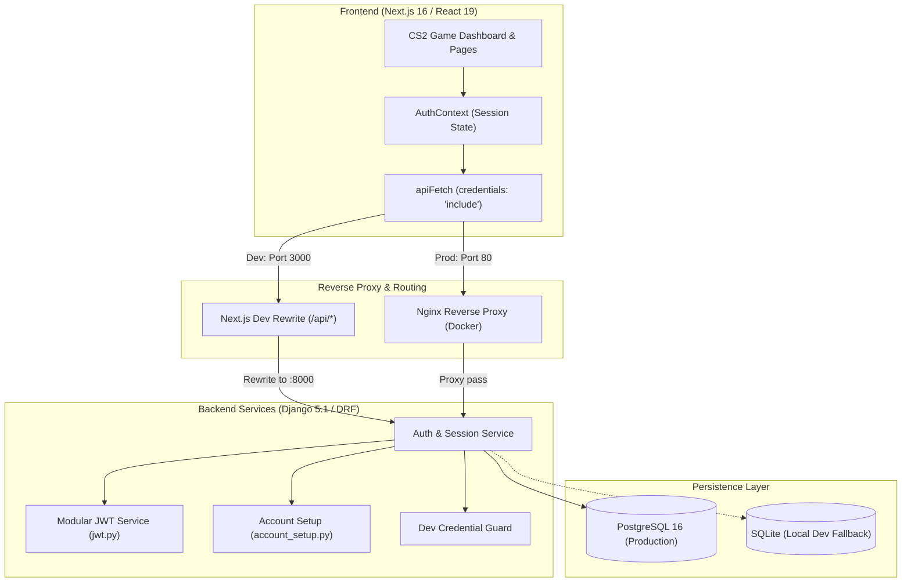

# Metsie — System Architecture & Technical Documentation

> **Metsie** is a competitive learning platform and fast-paced knowledge battleground where players race against the clock to answer questions across Science, Mathematics, and Computer Science.

---

## 1. High-Level System Architecture

Metsie follows a **decoupled, service-oriented architecture** with a modern Next.js frontend, an isolated Django REST backend for auth and user services, and a hardened zero-trust session layer using 7-day `httpOnly` JWT cookies.



---

## 2. Technology Stack

### Frontend (`/client`)
| Technology | Version | Purpose |
| :--- | :--- | :--- |
| **Next.js** | `16.3.4` (App Router) | React framework, SSR/client routing, asset optimization, local dev API proxy |
| **React** | `19.2.8` | Component model, React 19 compiler optimizations |
| **TypeScript** | `^5.x` | Strict end-to-end type safety |
| **Tailwind CSS** | `v4.x` | Modern utility styling via `@import "tailwindcss"` and `@theme inline` |
| **Motion** | `motion/react` | Smooth physics-based spring animations, avatar 360° spin, micro-interactions |
| **shadcn/ui** | Custom (New York / Zinc) | Accessible Radix UI-based primitives (`button`, `card`, `tooltip`, `avatar`, etc.) |
| **Lucide React** | `^1.42.0` | Minimalist SVG game interface icons |

### Backend (`/services`)
| Technology | Version | Purpose |
| :--- | :--- | :--- |
| **Python** | `3.12+` | Backend runtime environment |
| **Django** | `5.1.15` | Core application framework, ORM, security policies, admin |
| **Django REST Framework** | `3.15+` | Serializers, API views, permission and authentication classes |
| **PyJWT** | `2.8+` | Cryptographic signing and validation of stateless 7-day tokens |
| **PostgreSQL** | `16 (Alpine)` | Primary production relational database for user and profile persistence |
| **SQLite3** | Embedded | Zero-dependency local development fallback database |
| **django-cors-headers** | Latest | CORS headers handling for development cross-origin setups |

### Tooling & Quality Assurance (`/tests`)
- **Ruff**: Blazing-fast Python linter and formatter running against `services/pyproject.toml`.
- **ESLint**: Frontend code quality and React 19 hook validation.
- **Django TestCase**: Modular unit and integration tests for authentication, JWTs, and dev credentials.
- **Docker Compose**: Production multi-container composition (`nginx`, `client`, `auth-service`, `auth-db`).

---

## 3. Directory Structure

```
Metsie/
├── client/                               # Next.js 16 Frontend
│   ├── .env.local                        # Local frontend environment variables
│   ├── components.json                   # shadcn/ui configuration
│   ├── next.config.ts                    # API rewrites (/api/* -> :8000) & trailing slash rule
│   ├── src/
│   │   ├── app/
│   │   │   ├── layout.tsx                # Root layout with font definitions & AuthProvider
│   │   │   ├── globals.css               # Tailwind v4 theme, font vars & design tokens
│   │   │   ├── page.tsx                  # Public homepage with subject cards
│   │   │   ├── login/page.tsx            # Login with dev mode autofill helper
│   │   │   ├── register/page.tsx         # User registration
│   │   │   ├── account-setup/page.tsx    # Standalone onboarding profile setup
│   │   │   └── dashboard/                # CS2-inspired fullscreen game shell
│   │   │       ├── layout.tsx            # Game top nav bar & ProfileSidebar wrapper
│   │   │       ├── page.tsx              # Atmospheric battleground lobby
│   │   │       └── settings/page.tsx     # Glassmorphic user profile settings modal
│   │   ├── components/
│   │   │   ├── Navbar.tsx                # Public top navigation
│   │   │   ├── ConditionalNavbar.tsx     # Hides global navbar on /dashboard*
│   │   │   ├── ProfileSidebar.tsx        # Right-rail expandable player drawer with preset SVGs
│   │   │   └── ui/                       # shadcn/ui primitives + avatar-picker.tsx
│   │   ├── context/
│   │   │   └── AuthContext.tsx           # Global user state, login, register, logout hooks
│   │   ├── hooks/
│   │   │   └── use-mobile.tsx            # useSyncExternalStore mobile viewport detector
│   │   └── lib/
│   │       ├── api.ts                    # apiFetch client with credentials: 'include'
│   │       └── utils.ts                  # cn() utility (clsx + tailwind-merge)
├── services/                             # Django Backend
│   ├── .env                              # Django local environment configuration
│   ├── manage.py                         # Django management entry point
│   ├── config/                           # Django project configuration
│   │   ├── settings.py                   # Settings, APPEND_SLASH=False, JWT, Dev creds
│   │   ├── urls.py                       # Root router (/api/auth/ -> auth.urls)
│   │   ├── wsgi.py / asgi.py
│   │   └── pyproject.toml                # Ruff configuration
│   └── auth/                             # Modular Auth Service App
│       ├── models.py                     # UserProfile model (1-to-1 with User)
│       ├── jwt.py                        # Token generation, decoding, cookie attachment
│       ├── authentication.py             # CookieJWTAuthentication middleware for DRF
│       ├── account_setup.py              # UserProfile onboarding logic & serialization
│       ├── serializers.py                # LoginSerializer, RegisterSerializer
│       ├── views.py                      # LoginView, RegisterView, MeView, LogoutView
│       └── urls.py                       # re_path endpoints with optional trailing slashes
├── nginx/                                # Production Nginx reverse proxy configuration
│   └── nginx.conf
├── tests/                                # Test suites
│   ├── unit-test/                        # Fast Django unit tests (JWT, Auth, Dev creds)
│   │   └── run.sh
│   ├── e2e/                              # End-to-end integration tests
│   │   └── run.sh
│   └── lint/                             # Workspace linter orchestrator (Ruff + ESLint)
│       └── run.sh
├── dev.sh                                # Concurrently boots Django (:8000) & Next.js (:3000)
├── docker-compose.yml                    # Multi-container orchestration for production
└── package.json                          # Workspace root runner commands
```

---

## 4. Authentication & Security Model

Metsie enforces **zero-trust browser storage principles**:
- **Zero Tokens in LocalStorage**: Tokens are never accessible via JavaScript `localStorage` or `sessionStorage`, making authentication immune to XSS token theft.
- **7-Day `httpOnly` Cookie**: Authentication tokens are issued as an `access_token` cookie:
  - `HttpOnly = True`: Browser disallows JavaScript read access.
  - `SameSite = Lax`: Defends against Cross-Site Request Forgery (CSRF).
  - `Max-Age = 604800` (7 days).
  - `Path = /`.
  - `Secure`: Dynamically configured (`False` in dev, `True` in HTTPS production).
- **Client Session Hydration**:
  1. On initial mount, `AuthContext` calls `GET /api/auth/me/` using `apiFetch`.
  2. Because `credentials: 'include'` is set, the browser automatically sends the cookie.
  3. If valid, user identity and onboarding status are populated into React state.
  4. On logout, `POST /api/auth/logout/` instructs the browser to delete the cookie with `max_age=0`.

---

## 5. Authentication & Security Model

Metsie uses strict standard authentication across all environments:
- **Zero Backdoors**: All development dummy credentials and backdoor bypasses have been eliminated.
- **Database Backed**: Authentication validates directly against Django's `User` model using PBKDF2/Argon2.
- **Session Delivery**: 7-day `httpOnly`, `SameSite=Lax`, `Secure` JWT cookie (`access_token`).
- **Security Verification**: Validated by `tests/unit-test/test_production_security.py` ensuring former dev credentials cannot bypass auth.

---

## 6. Game UI & Design System

### Typography System
Configured in `client/src/app/layout.tsx` via `next/font/google` and exposed as CSS variables:
1. **Primary Font — Nunito (`--font-main` / `.font-main`)**:
   - Used for main headings, logo branding, subject titles, buttons, and high-impact game UI.
2. **Sub Font — DM Sans (`--font-sub` / `.font-sub`)**:
   - Used for body text, form inputs, labels, and secondary headings.
3. **Small Font — Inter (`--font-small` / `.font-small`)**:
   - Used for metadata, badges, captions, status indicators, and server pings.

### CS2-Inspired Fullscreen Game Dashboard
- **Layout Shell (`dashboard/layout.tsx`)**:
  - **Fixed Top Header**:
    - Left: Quick actions (`Home`, `Watch/Matches`, `Settings`, `Logout`).
    - Center: Main game tabs (`INVENTORY`, `LOADOUT`, `PLAY`, `STORE`, `NEWS`). Centered relative to the entire screen viewport (`fixed top-0 left-1/2 -translate-x-1/2`) to prevent asymmetrical offset from navbar items.
  - **Atmospheric Canvas (`dashboard/page.tsx`)**:
    - Deep zinc ambient backdrop with radial glow orbs (`violet`, `fuchsia`) and floor vignette reflection.
    - Zero visual clutter, providing a clean canvas for match queuing and 3D character staging.
  - **Right-Rail Profile Sidebar (`ProfileSidebar.tsx`)**:
    - **Current User**: Positioned at the very top, rendered with an enlarged circular preset avatar (`w-12 h-12`) and emerald online badge. Clicking routes to `/dashboard/settings`.
    - **Online Players**: Positioned at the bottom (`mt-auto`), rendered with circular SVG preset profile pictures.
    - **Hover-Expand Interaction**: Default width is a compact rail (`w-16`). Hovering smoothly widens it (`w-64`), revealing player display names, status ("In Lobby"), ranks, and live game activities without intrusive tooltips.
  - **Glassmorphic Settings Page (`dashboard/settings/page.tsx`)**:
    - Full-page glassmorphism (`backdrop-blur-2xl bg-zinc-950/40`) keeping the dashboard visible in the background.
    - Features `AvatarPicker` with animated 360° spring rotations and preset SVG character selection.
    - Profile form (Display Name, Competitive Title, Gamer Bio) with live persistence.

---

## 7. Critical Gotchas & Engineering Rules

### 1. Django `APPEND_SLASH = False` & URL Regexes
- **Problem**: Next.js proxy rewrites strip trailing slashes (`/api/auth/login` instead of `/api/auth/login/`). If Django has `APPEND_SLASH = True` (default), it responds with a `308 Permanent Redirect` or `301`, converting the `POST` request to a `GET` and dropping the payload.
- **Solution**:
  - `APPEND_SLASH = False` is set in `services/config/settings.py`.
  - `auth/urls.py` uses `re_path(r"^login/?$", ...)` to accept both `/login` and `/login/`.
  - `client/next.config.ts` has `skipTrailingSlashRedirect: true`.

### 2. Tailwind CSS v4 Configuration
- Tailwind v4 does **not** use `tailwind.config.ts`.
- Themes and custom tokens must be declared in `client/src/app/globals.css` under `@theme inline` mapping to CSS custom properties defined in `:root`.

### 3. React 19 State Updates in Effects
- Calling synchronous `setState` inside `useEffect` triggers cascading render errors in React 19 / ESLint compiler rules.
- Always initialize form state directly from props/auth context (`useState(user?.profile?.full_name || "")`) or defer async population via microtasks (`Promise.resolve().then(...)`).

### 4. CORS & `credentials: 'include'`
- Any request made via `fetch()` must include `credentials: 'include'`; otherwise, browsers will omit the 7-day `httpOnly` cookie.
- Backend CORS must have `CORS_ALLOW_CREDENTIALS = True` and must **never** use wildcard `*` for `CORS_ALLOWED_ORIGINS`.

---

## 8. Development & Workflow Commands

From the workspace root:

```bash
# Start both Django (:8000) and Next.js (:3000) concurrently
./dev.sh

# Run all automated unit tests (JWT, Auth, Dev credentials)
npm run test:unit
# Or: bash tests/unit-test/run.sh

# Run end-to-end test flows
npm run test:e2e
# Or: bash tests/e2e/run.sh

# Run full workspace linters (Ruff for backend + ESLint for frontend)
npm run lint

# Run backend or frontend linter separately
npm run lint:backend
npm run lint:frontend

# Build Docker production stack
docker-compose up --build
```
